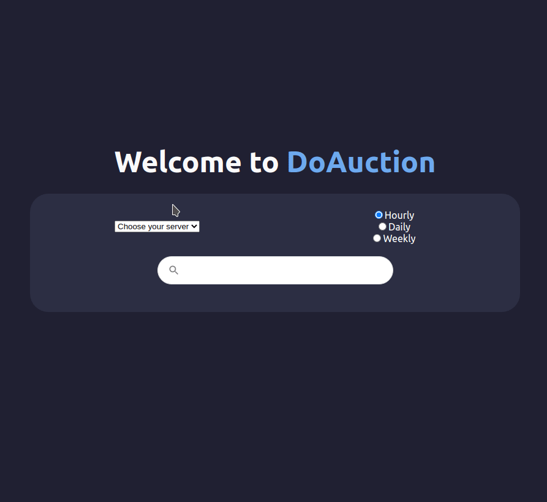

# 🕸️ DarkOrbit Auction Scraper

This project is what we call a "Hub Experience" in EPITECH. The purpose is to discover something new, explore new technologies and try to learn things that are not in our studies.

With this project I'm discovering the world of scraping, with a bot that is able to extract auctions prices on an old game named "DarkOrbit". The project consist in the creation of a bot that is able to self login and navigate in the different servers of the game. Then it is able to clone the page and inspect it to find specific values.

## 🏁 Run the project

The project build process has been automated with Docker to make the deployment in different environments easier. To install dependencies, build and run the different parts of the project follow the instructions below.

1. Copy and edit environment: `cp .env.sample .env`
2. Start the project with docker `docker-compose up --build`

## 🕸️ The Scraper

### Important notes

- Before you start the scraper, make sure the account you've configured is registered in all DarkOrbit's servers.

The scraper is using [Puppeteer](https://github.com/puppeteer/puppeteer) to render and access to different datas in the loaded pages. This lib can also be ran without a graphic interface (it's what we call "headless"). That's how you can run it in a docker container or a basic server.

You can enable or disable the `headless` parameter in the source code by toggling `puppeteer.launch` `headless` value in `./scraper/index.js` file.

The Scraper has an interval function to run every 3 hours. It makes sure that the bot will never miss a history value.

As you can see in the demo, it's also able to scrap the values for all servers.

## 🖌️ The Web Server

In the `./web-server` folder contains a Next.JS app that is able to display average prices for scraped results.

You can search for multiple items in different auctions frequencies ("Hourly", "Daily", "Weekly") the server will process the data and return an almost instant response.

At the moment it's only able to handle few requests, like the hourly auctions price average for the last week. In the future, there will be more options to customize the date range for values and min-max values for each items.

## 🏷️ Author

- [Theo Mazars](https://github.com/theo-mazars)

## 🔓 License

